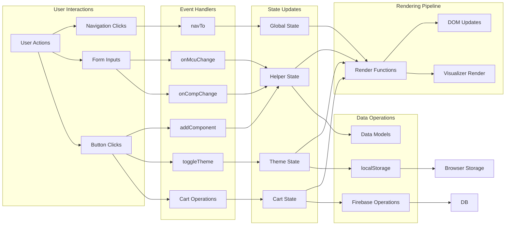
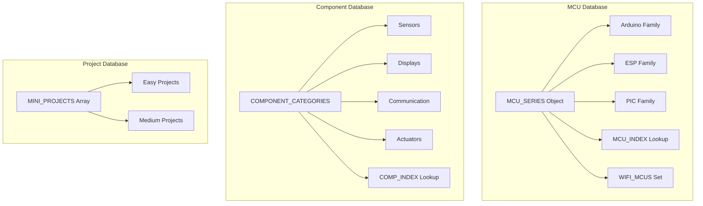
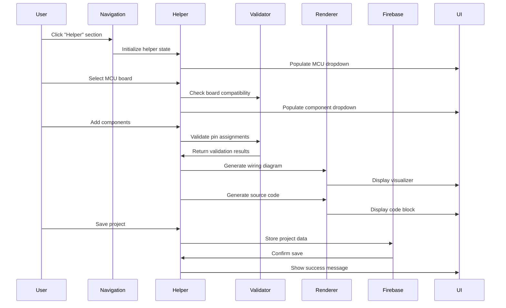

# Pieware 2 Architecture Diagram

## System Overview

```mermaid
graph TB
    subgraph "Client Side"
        UI[User Interface]
        HTML[index.html]
        CSS[style.css]
        JS[app.js]
        
        subgraph "Application Sections"
            HOME[Home Section]
            HUB[Project Hub]
            HELPER[Pinout Visualizer]
            SOURCE[Code Generator]
            CALC[Calculator]
            SHOP[Hardware Store]
            FEED[Feedback]
            ABOUT[About]
            ADMIN[Admin Panel]
        end
        
        subgraph "Core Modules"
            NAV[Navigation System]
            THEME[Theme Manager]
            I18N[Internationalization]
            STATE[Global State Management]
            VALID[Validation Engine]
            RENDER[Rendering Engine]
        end
        
        subgraph "Data Models"
            MCU[MCU Database<br/>57 Boards]
            COMP[Component Database<br/>123 Components]
            PROJ[Mini Projects<br/>35 Projects]
            CART[Shopping Cart]
            PROD[Products Catalog]
            ORDERS[Order Management]
        end
    end
    
    subgraph "Backend Services"
        FB[Firebase]
        AUTH[Firebase Auth]
        DB[Realtime Database]
        STORAGE[Firebase Storage]
    end
    
    subgraph "External Services"
        CYTRON[Cytron Store API]
        CHART[Chart.js]
        FONTS[Google Fonts]
    end
    
    UI --> HTML
    UI --> CSS
    UI --> JS
    
    JS --> NAV
    JS --> THEME
    JS --> I18N
    JS --> STATE
    JS --> VALID
    JS --> RENDER
    
    NAV --> HOME
    NAV --> HUB
    NAV --> HELPER
    NAV --> SOURCE
    NAV --> CALC
    NAV --> SHOP
    NAV --> FEED
    NAV --> ABOUT
    NAV --> ADMIN
    
    STATE --> MCU
    STATE --> COMP
    STATE --> PROJ
    STATE --> CART
    STATE --> PROD
    STATE --> ORDERS
    
    RENDER --> MCU
    RENDER --> COMP
    RENDER --> PROJ
    
    HELPER --> VALID
    HELPER --> MCU
    HELPER --> COMP
    
    SHOP --> PROD
    SHOP --> CART
    SHOP --> CYTRON
    
    ADMIN --> AUTH
    ADMIN --> DB
    ADMIN --> ORDERS
    ADMIN --> PROD
    
    JS --> FB
    FB --> AUTH
    FB --> DB
    FB --> STORAGE
    
    JS --> CHART
    HTML --> FONTS
```



## Data Flow Architecture



## Component Database Structure



## Key Module Interactions



## Firebase Integration

```mermaid
graph TB
    subgraph "Firebase Configuration"
        CONFIG[firebaseConfig]
        APP[firebase.initializeApp]
        DB[firebase.database]
        AUTH[firebase.auth]
    end
    
    subgraph "Database Structure"
        SHOP_PRODUCTS[shopProducts]
        ANNOUNCEMENT[announcement]
        FEEDBACK[feedback]
        ABOUT[about]
        ORDERS[orders]
        ADMIN_EMAILS[adminEmails]
    end
    
    subgraph "Real-time Listeners"
        ON_VALUE[.on('value')]
        PRODUCTS_LISTENER[loadProducts]
        ANNOUNCE_LISTENER[loadAnnouncement]
        FEEDBACK_LISTENER[loadFeedback]
        ABOUT_LISTENER[loadAbout]
    end
    
    subgraph "Operations"
        READ[Read Operations]
        WRITE[Write Operations]
        AUTH_OPS[Auth Operations]
    end
    
    CONFIG --> APP
    APP --> DB
    APP --> AUTH
    
    DB --> SHOP_PRODUCTS
    DB --> ANNOUNCEMENT
    DB --> FEEDBACK
    DB --> ABOUT
    DB --> ORDERS
    DB --> ADMIN_EMAILS
    
    SHOP_PRODUCTS --> ON_VALUE
    ANNOUNCEMENT --> ON_VALUE
    FEEDBACK --> ON_VALUE
    ABOUT --> ON_VALUE
    
    ON_VALUE --> PRODUCTS_LISTENER
    ON_VALUE --> ANNOUNCE_LISTENER
    ON_VALUE --> FEEDBACK_LISTENER
    ON_VALUE --> ABOUT_LISTENER
    
    DB --> READ
    DB --> WRITE
    AUTH --> AUTH_OPS
```

## File Structure

```
pieware 2.0 (gemini)/
├── index.html          # Main HTML structure with all sections
├── app.js             # Core application logic (2776 lines)
├── style.css          # Styling and theming
├── README.md          # Project documentation
├── CHANGELOG.md       # Version history
└── ARCHITECTURE.md    # This architecture diagram
```

## Technology Stack

- **Frontend**: Vanilla HTML, CSS, JavaScript
- **Backend**: Firebase Realtime Database + Firebase Auth
- **Libraries**: 
  - Firebase SDK (v10.12.2)
  - Chart.js (v4.4.0)
  - Google Fonts
- **Hosting**: Vercel (previously Netlify)
- **Deployment**: Automatic via GitHub

## Core Features Flow

1. **Pinout Visualizer (Helper)**
   - User selects MCU board → Populates component options
   - User adds components → Validates pin assignments
   - System generates wiring diagram + source code
   - Visual feedback for validation warnings

2. **Hardware Store**
   - Products loaded from Firebase
   - Shopping cart managed in local state
   - Orders saved to Firebase database
   - Admin panel for product/order management

3. **Project Hub**
   - Static links to external resources
   - Mini projects database with component mappings
   - One-click load into Helper

4. **Component Dictionary**
   - Searchable database of MCUs and components
   - Category filtering
   - Direct integration with Helper

## Security Considerations

- HTML escaping function `esc()` prevents XSS
- Firebase rules for data access control
- Admin authentication required for sensitive operations
- Affiliate link sanitization

## Performance Optimizations

- Lazy loading for images
- Debounced search inputs
- Efficient DOM updates
- Real-time Firebase listeners with selective updates
- CSS animations with hardware acceleration