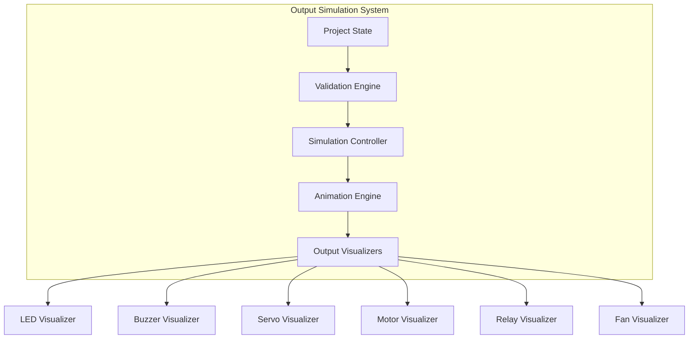

# Implementation Plan: New Mini Projects & Output Simulation System

## Overview
This plan outlines the implementation of:
1. **34 new mini projects** to add to the Helper tab's quick start templates
2. **Output simulation system** to visualize project outputs (lamps, fans, etc.)
3. **Enhanced component database** with new output devices

---

## Phase 1: Add New Mini Projects

### Current State Analysis
- **Location**: `app.js` lines 1406-1442
- **Format**: `['Project Name', 'Difficulty', 'MCU Board', ['Component1', 'Component2', ...]]`
- **Current Count**: 35 projects
- **Target Count**: 69 projects (35 existing + 34 new)

### New Projects to Add

#### Easy Projects (18)
1. **Autofeed System** - Servo MG996R + RTC DS3231
2. **Smart Street Light with Motion Sensor** - HC-SR501 PIR + LDR + Relay
3. **Sound Activated Room Fan** - KY-037 Microphone + Relay Module
4. **Tank Overflow Alarm** - HC-SR04 Ultrasonic + Buzzer + LED
5. **Smart Slot Parking Detector** - HC-SR04 Ultrasonic + LED + Servo SG90
6. **Astroface Expression Candy** - OLED + MPU-6050 (custom display)
7. **Bluetooth Car** - HC-05 Bluetooth + L298N Motor Driver
8. **Smart Library Book Borrowing** - RFID RC522 + OLED
9. **Smart Mailbox Notification** - Hall Effect + WiFi
10. **Automatic Hand Sanitizer Dispenser** - HC-SR04 + Servo SG90
11. **Smart Blind Stick** - HC-SR04 + Buzzer + MQ-2 Gas
12. **Smart Gas Leakage Detection** - MQ-2 Gas + Buzzer + WiFi
13. **Interactive Electronic Dice** - MPU-6050 + 8x8 LED Matrix
14. **Anti-Theft Backpack Alarm** - Hall Effect + Buzzer
15. **Smart Classroom Noise Monitor** - KY-037 Microphone + OLED
16. **Smart USB Cable Tester** - LED + Buzzer
17. **Mini Temperature Warning** - DHT11 + Buzzer + LED
18. **Early TCAS using Ultrasonic Sensor and IMU** - HC-SR04 + MPU-6050

#### Medium Projects (16)
1. **MeetingRoom AutoSync System** - RTC DS3231 + OLED + WiFi
2. **Manual Light Sensor RFID** - RFID + LDR + LED
3. **Digital LED Hourglass** - MPU-6050 + LED array
4. **Fire Detection and Alert** - Flame Sensor + MQ-2 + Buzzer
5. **Smart Medicine Reminder** - RTC + Buzzer + LCD
6. **Smart Home Lighting** - PIR + Relay + LDR
7. **Smart Clothes Dryer** - DHT11 + L298N Motor Driver
8. **Loud Noise Detector** - KY-037 + LED + Buzzer
9. **Smart Plant Watering** - Soil Moisture + Relay
10. **Smart Home Lighting System** - Multiple relays + sensors
11. **Smart Clothes Dryer Enhanced** - DHT22 + Servo + Display
12. **Sound Activated Fan with Speed Control** - Microphone + PWM + Motor Driver
13. **Smart Parking with Multi-level** - Multiple ultrasonic + Display
14. **Face Expression Candy Advanced** - Camera + OLED + Servo
15. **Bluetooth Car with Obstacle Avoidance** - Bluetooth + Motors + Ultrasonic
16. **Smart Library with Database** - RFID + WiFi + Display

### Implementation Steps

#### Step 1: Update MINI_PROJECTS Array
**File**: `app.js` (lines 1406-1442)

```javascript
const MINI_PROJECTS = [
    // ... existing 35 projects ...
    
    // NEW PROJECTS - Easy Level
    ['Auto Feed System (Pet/Chicken)', 'Medium', UNO, ['Servo MG996R', 'RTC DS3231']],
    ['Smart Street Light + Motion', 'Easy', UNO, ['HC-SR501 PIR Motion Sensor', 'LDR Light Sensor Module', 'Relay Module 1 Channel (5V)']],
    ['Sound Activated Room Fan', 'Easy', UNO, ['KY-037 Microphone Sound Sensor', 'Relay Module 1 Channel (5V)']],
    ['Tank Overflow Alarm', 'Easy', UNO, ['HC-SR04 Ultrasonic Sensor', 'Buzzer (Active)', 'LED 5mm (Red/Green/Blue/Yellow/White)']],
    ['Smart Slot Parking Detector', 'Easy', UNO, ['HC-SR04 Ultrasonic Sensor', 'LED 5mm (Red/Green/Blue/Yellow/White)', 'Servo SG90']],
    ['Astroface Expression Candy', 'Medium', ESP32D, ['OLED 0.96" SSD1306 (I2C)', 'MPU-6050 Gyro + Accelerometer']],
    ['Bluetooth Car', 'Medium', UNO, ['HC-05 Bluetooth Module', 'L298N Motor Driver']],
    ['Library Book Borrowing System', 'Medium', ESP32D, ['RFID RC522 Module', 'OLED 0.96" SSD1306 (I2C)']],
    ['Smart Mailbox Notification', 'Easy', ESP32D, ['Hall Effect Sensor (A3144)', 'WiFi Web Client (HTTP)']],
    ['Auto Hand Sanitizer Dispenser', 'Easy', UNO, ['HC-SR04 Ultrasonic Sensor', 'Servo SG90']],
    ['Smart Blind Stick', 'Easy', UNO, ['HC-SR04 Ultrasonic Sensor', 'Buzzer (Active)', 'MQ-2 Gas Sensor']],
    ['Gas Leakage Detection & Alert', 'Easy', ESP32D, ['MQ-2 Gas Sensor', 'Buzzer (Active)', 'WiFi Web Client (HTTP)']],
    ['Interactive Electronic Dice', 'Medium', UNO, ['MPU-6050 Gyro + Accelerometer', '8x8 LED Matrix']],
    ['Anti-Theft Backpack Alarm', 'Easy', UNO, ['Hall Effect Sensor (A3144)', 'Buzzer (Active)']],
    ['Classroom Noise Monitor', 'Easy', UNO, ['KY-037 Microphone Sound Sensor', 'OLED 0.96" SSD1306 (I2C)']],
    ['Smart USB Cable Tester', 'Easy', 'Maker Uno (Cytron)', ['LED 5mm (Red/Green/Blue/Yellow/White)', 'Buzzer (Active)']],
    ['Mini Temperature Warning System', 'Easy', UNO, ['DHT11 Temperature & Humidity Sensor', 'Buzzer (Active)', 'LED 5mm (Red/Green/Blue/Yellow/White)']],
    ['Early TCAS using Ultrasonic Sensor and IMU', 'Medium', ESP32D, ['HC-SR04 Ultrasonic Sensor', 'MPU-6050 Gyro + Accelerometer']],
    
    // NEW PROJECTS - Medium Level  
    ['Meeting Room AutoSync System', 'Medium', ESP32D, ['RTC DS3231', 'OLED 0.96" SSD1306 (I2C)', 'WiFi Web Client (HTTP)']],
    ['Manual Light Sensor RFID', 'Medium', UNO, ['RFID RC522 Module', 'LDR Light Sensor Module', 'LED 5mm (Red/Green/Blue/Yellow/White)']],
    ['Digital LED Hourglass', 'Medium', UNO, ['MPU-6050 Gyro + Accelerometer', 'LED 5mm (Red/Green/Blue/Yellow/White)']],
    ['Fire Detection & Alert System', 'Easy', UNO, ['Flame Sensor Module', 'MQ-2 Gas Sensor', 'Buzzer (Active)']],
    ['Smart Medicine Reminder', 'Medium', UNO, ['RTC DS3231', 'Buzzer (Active)', 'LCD 16x2 with I2C Adapter']],
    ['Smart Home Lighting System', 'Easy', UNO, ['HC-SR501 PIR Motion Sensor', 'Relay Module 1 Channel (5V)', 'LDR Light Sensor Module']],
    ['Smart Clothes Dryer', 'Medium', UNO, ['DHT11 Temperature & Humidity Sensor', 'L298N Motor Driver']],
    ['Loud Noise Detector', 'Easy', UNO, ['KY-037 Microphone Sound Sensor', 'LED 5mm (Red/Green/Blue/Yellow/White)', 'Buzzer (Active)']],
    ['Smart Plant Watering System', 'Medium', UNO, ['Soil Moisture Sensor', 'Relay Module 1 Channel (5V)']],
];
```

#### Step 2: Update Project Count Display
**File**: `app.js` (line 187 in Hub section HTML)
- Update text from "35 beginner-friendly projects" to "69 beginner-friendly projects"

#### Step 3: Test New Projects
- Load each new project in Helper
- Verify component compatibility
- Check wiring validation
- Test code generation

---

## Phase 2: Output Simulation System

### Current State
- Components are displayed visually in `vis-comps` div
- No real-time output simulation
- Static component visualization only

### New Output Simulation Design

#### Concept
When a project is loaded and wiring is validated, output components should show visual feedback:
- **LED**: Glow when connected correctly
- **Buzzer**: Show sound wave animation when active
- **Servo**: Show rotation animation
- **Motor**: Show spinning animation
- **Relay**: Show switch state (ON/OFF)
- **Fan**: Show spinning blade animation

#### Implementation Architecture



### Step 1: Add Output Component Flags

**File**: `app.js` - Update COMPONENT_CATEGORIES

Add output type flags to component definitions:

```javascript
// In component definitions, add output type:
{ 
    n: 'LED 5mm (Red/Green/Blue/Yellow/White)', 
    k: 'dout', 
    p: ['Anode (+)', 'Cathode (-)'], 
    output: 'led',  // NEW: output type
    warn: 'Always use a series resistor (220-330 ohm).' 
},
{ 
    n: 'Buzzer (Active)', 
    k: 'dout', 
    p: ['+', '-'], 
    output: 'buzzer',  // NEW: output type
},
{ 
    n: 'Servo SG90', 
    k: 'servo', 
    p: ['VCC', 'SIG', 'GND'], 
    output: 'servo',  // NEW: output type
    warn: 'May draw more current than USB provides — use external 5V supply.' 
},
```

### Step 2: Create Simulation Controller

**File**: `app.js` - Add new functions

```javascript
// Output Simulation State
let simulationActive = false;
let simulationInterval = null;

// Start output simulation
function startOutputSimulation() {
    if (simulationActive) return;
    
    const validation = validateProject();
    if (validation.some(v => v.level === 'red')) {
        showToast('Fix wiring errors before simulation');
        return;
    }
    
    simulationActive = true;
    updateOutputVisuals();
    
    // Update visuals every 100ms for animation
    simulationInterval = setInterval(updateOutputVisuals, 100);
    
    showToast('🎬 Output simulation started');
}

// Stop output simulation  
function stopOutputSimulation() {
    simulationActive = false;
    if (simulationInterval) {
        clearInterval(simulationInterval);
        simulationInterval = null;
    }
    resetOutputVisuals();
    showToast('⏹️ Simulation stopped');
}

// Update output component visuals
function updateOutputVisuals() {
    helperComps.forEach(compName => {
        const comp = COMP_INDEX[compName];
        if (!comp || !comp.output) return;
        
        const visElement = document.getElementById(`output-${compName.replace(/\s+/g, '-')}`);
        if (!visElement) return;
        
        switch(comp.output) {
            case 'led':
                updateLEDVisual(visElement, simulationActive);
                break;
            case 'buzzer':
                updateBuzzerVisual(visElement, simulationActive);
                break;
            case 'servo':
                updateServoVisual(visElement, simulationActive);
                break;
            case 'motor':
                updateMotorVisual(visElement, simulationActive);
                break;
            case 'relay':
                updateRelayVisual(visElement, simulationActive);
                break;
        }
    });
}

// Reset all output visuals
function resetOutputVisuals() {
    document.querySelectorAll('[id^="output-"]').forEach(el => {
        el.className = el.className.replace(/simulating|active|on/g, '').trim();
    });
}
```

### Step 3: Create Output Visualizer Functions

```javascript
// LED Visualizer
function updateLEDVisual(element, active) {
    if (active) {
        element.classList.add('simulating', 'led-glow');
        // Add pulsing effect
        element.style.animation = 'ledPulse 1s infinite';
    } else {
        element.classList.remove('simulating', 'led-glow');
        element.style.animation = 'none';
    }
}

// Buzzer Visualizer
function updateBuzzerVisual(element, active) {
    if (active) {
        element.classList.add('simulating', 'buzzer-active');
        element.style.animation = 'buzzerWave 0.5s infinite';
    } else {
        element.classList.remove('simulating', 'buzzer-active');
        element.style.animation = 'none';
    }
}

// Servo Visualizer
function updateServoVisual(element, active) {
    if (active) {
        element.classList.add('simulating', 'servo-moving');
        element.style.animation = 'servoSweep 2s ease-in-out infinite';
    } else {
        element.classList.remove('simulating', 'servo-moving');
        element.style.animation = 'none';
    }
}

// Motor Visualizer
function updateMotorVisual(element, active) {
    if (active) {
        element.classList.add('simulating', 'motor-spinning');
        element.style.animation = 'motorSpin 0.5s linear infinite';
    } else {
        element.classList.remove('simulating', 'motor-spinning');
        element.style.animation = 'none';
    }
}

// Relay Visualizer
function updateRelayVisual(element, active) {
    if (active) {
        element.classList.add('simulating', 'relay-on');
        element.textContent = 'ON';
    } else {
        element.classList.remove('simulating', 'relay-on');
        element.textContent = 'OFF';
    }
}
```

### Step 4: Update Component Rendering

**File**: `app.js` - Modify `renderHelper()` function (around line 1999)

```javascript
// Updated component rendering with output simulation support
document.getElementById('vis-comps').innerHTML = helperComps.map(n => {
    const c = COMP_INDEX[n] || { p: [] };
    const pins = (c.k === 'passive') ? ['—'] : (c.p.length ? c.p : ['📶']);
    const isOutput = c.output ? `output-${n.replace(/\s+/g, '-')}` : '';
    const outputIcon = c.output ? getOutputIcon(c.output) : '';
    
    return '<div class="board-visual" style="max-width:340px;">' +
        '<h3 style="font-size:0.82rem;">' + esc(n) + ' ' + outputIcon + '</h3>' +
        '<div class="pins-grid">' + pins.map(p => '<span class="pin-node highlight">' + esc(p) + '</span>').join('') + '</div>' +
        (c.output ? '<div id="' + isOutput + '" class="output-indicator">⭕ OFF</div>' : '') +
        '</div>';
}).join('');

// Helper function to get output icons
function getOutputIcon(outputType) {
    const icons = {
        'led': '💡',
        'buzzer': '🔊',
        'servo': '⚙️',
        'motor': '🔄',
        'relay': '🔌',
        'fan': '🌀'
    };
    return icons[outputType] || '';
}
```

### Step 5: Add CSS Animations

**File**: `style.css` - Add animation keyframes

```css
/* Output Simulation Animations */
@keyframes ledPulse {
    0%, 100% { opacity: 1; box-shadow: 0 0 10px currentColor; }
    50% { opacity: 0.5; box-shadow: 0 0 20px currentColor; }
}

@keyframes buzzerWave {
    0%, 100% { transform: scale(1); }
    50% { transform: scale(1.1); }
}

@keyframes servoSweep {
    0%, 100% { transform: rotate(-45deg); }
    50% { transform: rotate(45deg); }
}

@keyframes motorSpin {
    from { transform: rotate(0deg); }
    to { transform: rotate(360deg); }
}

/* Output Indicator Styles */
.output-indicator {
    margin-top: 0.5rem;
    padding: 0.3rem 0.6rem;
    border-radius: var(--radius-md);
    background: rgba(255, 255, 255, 0.1);
    font-size: 0.7rem;
    font-weight: 700;
    text-align: center;
    transition: all 0.3s ease;
}

.output-indicator.simulating {
    background: rgba(16, 185, 129, 0.2);
    color: var(--secondary);
}

.output-indicator.relay-on {
    background: rgba(16, 185, 129, 0.3);
    color: var(--secondary);
}

.led-glow {
    color: #FFD700;
    text-shadow: 0 0 10px #FFD700;
}

.buzzer-active {
    color: #FF6B6B;
    animation: buzzerWave 0.3s infinite;
}

.servo-moving {
    transition: transform 0.5s ease-in-out;
}

.motor-spinning {
    animation: motorSpin 0.3s linear infinite;
}
```

### Step 6: Add Simulation Controls to UI

**File**: `index.html` - Add simulation controls in Helper section

```html
<!-- Add after Generate Source Code button -->
<div style="display:flex; gap:0.5rem; margin-top: var(--space-md); flex-wrap:wrap;">
    <button class="btn btn-secondary" style="flex:1;" onclick="navToCodeFromHelper()">Generate Source Code</button>
    <button class="btn btn-gold" style="flex:1;" onclick="toggleSimulation()" id="sim-btn">▶️ Start Simulation</button>
    <button class="btn btn-outline btn-sm" onclick="copyWiring()" title="Copy wiring instructions as text">📋 Copy Wiring</button>
    <button class="btn btn-outline btn-sm" onclick="shareProject()" title="Copy shareable project link">📤 Share</button>
    <button class="btn btn-outline btn-sm" onclick="exportBOM()" title="Download Bill of Materials as CSV">📦 BOM</button>
    <button class="btn btn-outline btn-sm" onclick="exportChatGPT()" title="Copy a ready prompt for ChatGPT / AI assistants">🤖 AI Prompt</button>
</div>
```

**File**: `app.js` - Add toggle function

```javascript
function toggleSimulation() {
    const btn = document.getElementById('sim-btn');
    if (simulationActive) {
        stopOutputSimulation();
        btn.textContent = '▶️ Start Simulation';
        btn.classList.remove('btn-outline');
        btn.classList.add('btn-gold');
    } else {
        startOutputSimulation();
        btn.textContent = '⏹️ Stop Simulation';
        btn.classList.remove('btn-gold');
        btn.classList.add('btn-outline');
    }
}
```

---

## Phase 3: Add New Output Components

### New Components to Add to Database

#### Lighting Components
```javascript
{ n: 'Light Bulb (5V)', k: 'dout', p: ['+', '-'], output: 'lamp', warn: 'Use with appropriate relay for mains voltage.' },
{ n: 'DC Fan 5V', k: 'motor', p: ['+', '-'], output: 'fan', warn: 'Check current rating - may need transistor for high-power fans.' },
{ n: 'Strip Light LED', k: 'dout', p: ['+', '-'], output: 'led', warn: 'May require external power supply for long strips.' },
```

#### Advanced Output Components
```javascript
{ n: 'Stepper Motor with Driver', k: 'stepper4', p: ['IN1', 'IN2', 'IN3', 'IN4'], output: 'motor' },
{ n: 'Brushless DC Motor', k: 'motor', p: ['ESC Signal'], output: 'motor', warn: 'Requires ESC controller - not direct MCU connection.' },
{ n: 'Solenoid Lock 12V', k: 'dout', p: ['+', '-'], output: 'relay', warn: 'Requires 12V supply and relay/transistor driver.' },
```

### Implementation Steps

#### Step 1: Add to COMPONENT_CATEGORIES
**File**: `app.js` - Add to appropriate categories

#### Step 2: Update COMP_INDEX
- Automatic index update happens via existing code

#### Step 3: Test Component Integration
- Add new components to test projects
- Verify wiring validation
- Check output simulation

---

## Phase 4: Enhanced Code Generation

### Update Code Templates for New Outputs

**File**: `app.js` - Update code generation functions

```javascript
// Enhanced code generation with output simulation comments
function generateCodeWithOutputSimulation() {
    const baseCode = generateSourceCode();
    
    // Add simulation comments for output components
    const outputComments = helperComps
        .map(n => {
            const comp = COMP_INDEX[n];
            if (!comp || !comp.output) return '';
            return `// OUTPUT: ${n} - ${comp.output.toUpperCase()} simulation active`;
        })
        .filter(c => c)
        .join('\n    ');
    
    return baseCode.replace(
        '// === PIN DEFINITIONS ===',
        `// === OUTPUT SIMULATION ===\n    ${outputComments}\n\n// === PIN DEFINITIONS ===`
    );
}
```

---

## Testing Plan

### Phase 1 Testing
- [ ] All 34 new projects load correctly
- [ ] Component compatibility validation works
- [ ] Wiring diagrams generate correctly
- [ ] Code generation produces valid Arduino code
- [ ] Search and filter functions work with new projects

### Phase 2 Testing
- [ ] Simulation starts/stops correctly
- [ ] LED visualizer shows glow animation
- [ ] Buzzer visualizer shows wave animation
- [ ] Servo visualizer shows rotation animation
- [ ] Motor visualizer shows spinning animation
- [ ] Relay visualizer shows ON/OFF state
- [ ] Simulation respects validation state (won't start with errors)

### Phase 3 Testing
- [ ] New output components appear in component selector
- [ ] New components integrate with existing projects
- [ ] Output simulation works with new components
- [ ] Code generation includes new components

### Integration Testing
- [ ] Full workflow: Load project → Validate → Simulate → Generate Code
- [ ] Cross-browser compatibility
- [ ] Mobile responsiveness
- [ ] Performance with multiple outputs

---

## Deployment Plan

### Development Environment
1. Create feature branch: `feature/new-projects-output-simulation`
2. Implement changes incrementally
3. Test each phase before proceeding

### Deployment Steps
1. **Phase 1**: Deploy new projects (low risk)
2. **Phase 2**: Deploy output simulation (medium risk)
3. **Phase 3**: Deploy new components (low risk)
4. **Phase 4**: Deploy enhanced code generation (low risk)

### Rollback Plan
- Keep backups of original `app.js` and `style.css`
- Git commits for each phase
- Feature flags for simulation system

---

## Success Criteria

### Quantitative
- 34 new mini projects successfully added
- 6+ output types with visual simulation
- 100% backward compatibility with existing projects
- <2 second load time for project list

### Qualitative
- Intuitive simulation controls
- Clear visual feedback for outputs
- Educational value for students
- Professional appearance of animations

---

## Future Enhancements

### Short-term
- Add sound effects for buzzer simulation
- Create preset simulation scenarios
- Add simulation speed controls

### Long-term
- Real-time sensor data simulation
- 3D component visualization
- Project behavior prediction
- Integration with physical hardware

---

## Estimated Timeline

- **Phase 1** (New Projects): 2-3 hours
- **Phase 2** (Output Simulation): 4-6 hours  
- **Phase 3** (New Components): 1-2 hours
- **Phase 4** (Code Generation): 1-2 hours
- **Testing**: 2-3 hours
- **Total**: 10-16 hours

---

## Notes

### Technical Considerations
- Performance impact of animations (use CSS transforms)
- Memory management for simulation intervals
- Accessibility considerations for animations
- Mobile device performance optimization

### Educational Considerations
- Simulation should not replace physical testing
- Clear labeling that this is a simulation
- Encourage real-world implementation
- Safety warnings for high-power components